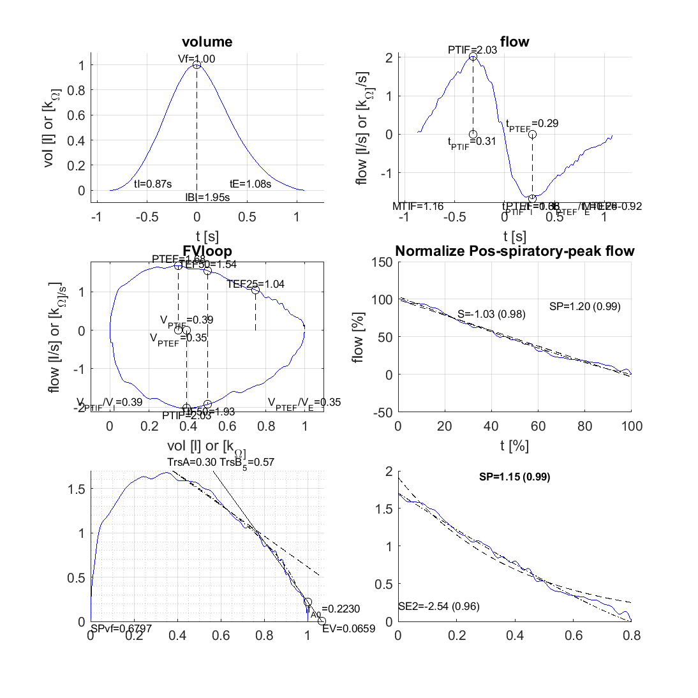

# tidal_breathing_linear_parameters
Algorithm to calculate features from a single tidal breath. 
Features include 

- 'Vt' = tidal volume 
- 'tI' = inspiration time
- 'tE' = expiration time
- 'PTIF' = peak tidal inspiratory flow
- 't_PTIF' = time to peak tidal inspiratory flow
- 'MTIF' = mean tidal inspiratory flow
- 'tPTIF_per_tI' = time to peak tidal inspiratory flow / inspiration time 
- 'VPTIF_per_VI' = volume to peak tidal inspiratory flow / inpiration volume 
- 'TIF50' = flow at 50% inspired volume
- 'PTEF' = peak tidal expiratory flow 
- 't_PTEF' = time to peak tidal expiratory flow 
- 'MTEF' = mean tidal expiratory flow,
- 'tPTEF_per_tE' = time to peak tidal expiration flow / expiration time  
- 'V_PTEF' = 
- 'VPTEF_per_VE' = 
- 'TEF50' = flow at 50% remaining expiration volume
- 'TEF25' = flow at 25% remaining expiration volume
above parameters as defined in [1]
- 'S','Sintercept','S2' = [2]
- 'Trs','EV' = [3]
- 'SPvf' = [4]

1. [Thoracic Society/European Respiratory Society Statement: Pulmonary Function Testing, Beydon N, et al.](https://www.ncbi.nlm.nih.gov/pubmed/17545458)
2. [Tidal expired airflow patterns in adults with airway obstruction,  Williams E. et al.](https://erj.ersjournals.com/content/12/5/1118.short)
3. [Analysis of expiratory tidal flow patterns as a diagnostic tool in airflow obstruction, Morris MJ, et al. ](https://erj.ersjournals.com/content/12/5/1113.short)
4. [Tidal breathing flow profiles during sleep phases in wheezing infants measured by impedance pneumography,  Gracia-Tabuenca J, et al. ](https://www.physiology.org/doi/abs/10.1152/japplphysiol.01007.2018)

Repo includes :

- parameters1cycle.m : main function 
- FV_trs_ev_5gd.m & getT.m: sub functions
- respiratory_cycle.mat :file with data to test the main function 
- test.mlx : file with an example running main fuction with data in respiratory_cycle.mat

# Example : 

Author: javier.gracia.tabuenca   Date: 12.12.2018
